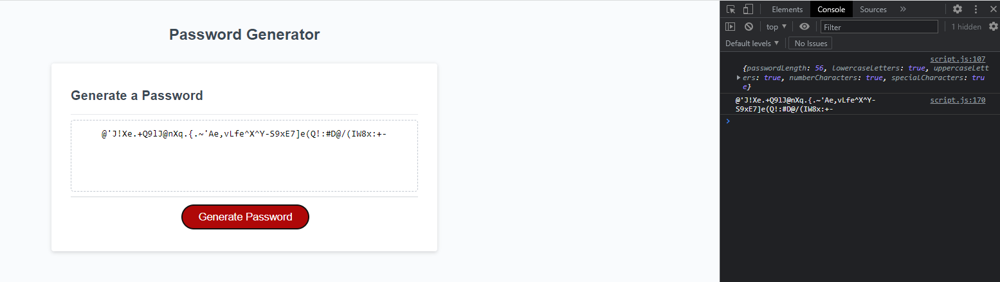

# Password-Generator - Bootcamp Week 5

## Intermediate JavaScript: Password Generator

This project uses JavaScript to randomly generate a password based on criteria selected by user input.

The page will generate a password when the button is clicked. The user is prompted for a series of criteria, including:

Length of password: At least 10 characters but no more than 64.

Character types: Lowercase, Uppercase, Numeric, Special characters ($@%&*, etc.)

The code validates for each input and at least one character type should be selected.

Once all prompts are answered, the password is generated and displayed on the page.

## Usage

Here is a mock up of the page:

When the user clicks generate password, a series of prompts pop up: 

After validation, a password is generated:

## Credits

[Assignment] https://courses.bootcampspot.com/courses/3021/assignments/44743?module_item_id=832276

## Link to deployed application

https://sonia-deni.github.io/Password-Generator/

## License

This project is licensed under the MIT License

## Badges

